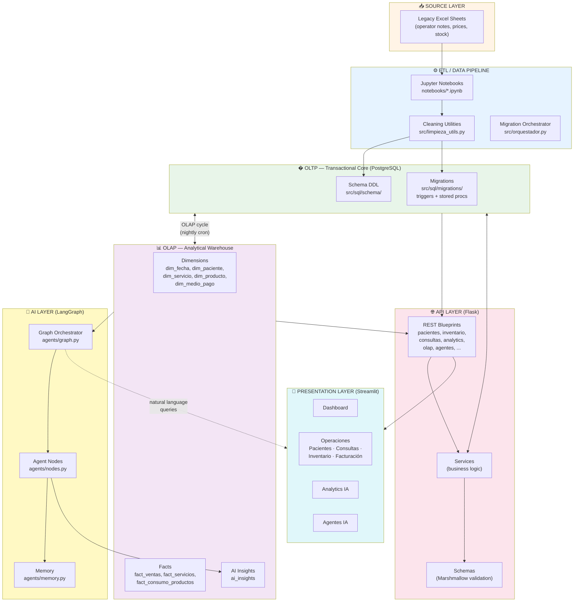
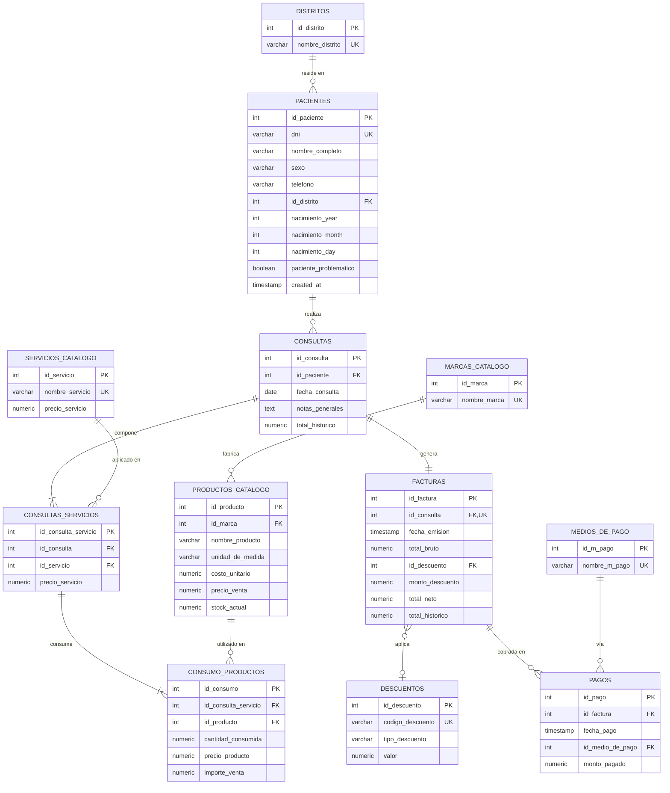
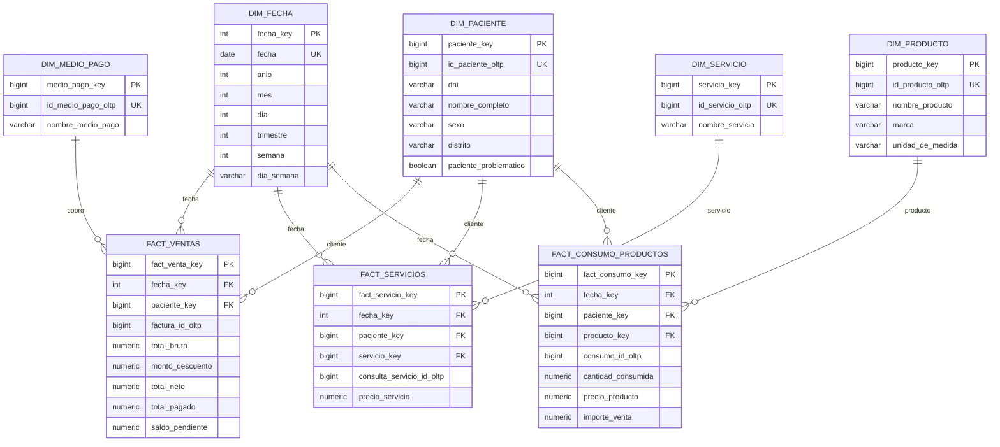
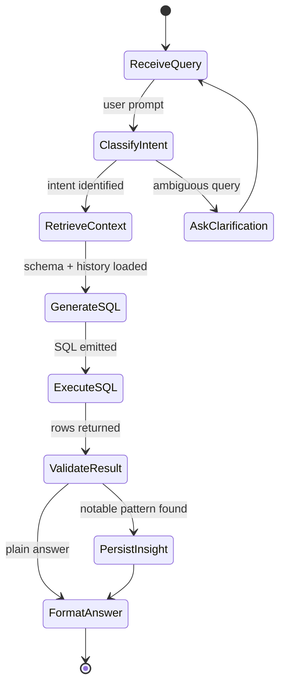

# 🏥 MediStock — Clinical ERP & Data Platform

[](https://www.python.org/)
[](https://www.postgresql.org/)
[](https://flask.palletsprojects.com/)
[](https://langchain-ai.github.io/langgraph/)
[](https://streamlit.io/)
[]()

> **MediStock** is a complete **Clinical ERP + Data Warehouse + AI Analytics Platform** for medical-aesthetic clinics. It transforms messy Excel legacy data into a normalized PostgreSQL transactional database, serves it through a REST API, projects it into an OLAP star schema, and exposes business insights through LangGraph AI agents.

---

## 🎯 What problem does it solve?

Aesthetic clinics run on **unstructured data**: handwritten notes, free-text operator comments, inconsistent Excel sheets. MediStock gives them:

1. **A single source of truth** for patients, consultations, inventory and finances.
2. **Real-time stock control** of medical supplies (Botox, syringes, etc.).
3. **Financial reconstruction** — inferring debts and payments from messy operator notes.
4. **Self-service BI** through a Streamlit dashboard and an AI agent that answers questions in natural language.

---

## 🏛️ Architecture Overview

The platform runs as **four decoupled layers** that talk to each other through well-defined contracts.



---

## 📦 Project Structure

```
medistock/
│
├── notebooks/                  # ETL orchestration (Jupyter)
│   ├── clinica_prime.ipynb     #   Main pipeline
│   ├── etl_v1.ipynb            #   Legacy version
│   └── etl_v2.ipynb            #   Pandas-separation version
│
├── src/
│   ├── limpieza_utils.py       # 🧹 Data cleaning toolkit (the "Taller")
│   ├── catalogo.py             # � Catalog loader (services, brands)
│   ├── orquestador.py          # 🚚 SQL migration runner (psql-based)
│   ├── hidden.py               # ⚠️  Local credentials (REPLACE with .env)
│   │
│   ├── clinica_backend/        # 🌐 Flask API
│   │   ├── run.py              #   Entry point
│   │   └── app/
│   │       ├── config.py       #   Environment configuration
│   │       ├── extensions.py   #   db, migrate, ma, cors
│   │       ├── models/         #   16 SQLAlchemy ORM models
│   │       ├── routes/         #   16 REST blueprints
│   │       ├── schemas/        #   Marshmallow validators
│   │       ├── services/       #   8 business-logic services
│   │       ├── agents/         #   🤖 LangGraph (graph, memory, nodes, state)
│   │       └── utils/          #   response helpers
│   │
│   ├── clinica_frontend/       # 🎨 Streamlit UI
│   │   ├── app.py              #   Home page + health check
│   │   ├── config.py           #   UI settings
│   │   ├── services/           #   api_client, ml_client
│   │   ├── modules/            #   api/, auth/, utils/, validators/
│   │   └── pages/              #   7 multipage screens
│   │       ├── 01_Dashboard.py
│   │       ├── 02_Pacientes.py
│   │       ├── 03_Consultas.py
│   │       ├── 04_Inventario.py
│   │       ├── 05_Facturacion.py
│   │       ├── 06_Analytics_IA.py
│   │       └── 07_Agentes_IA.py
│   │
│   ├── jobs/                   # 🔄 Background jobs
│   │   ├── setup_olap.py       #   First-time OLAP bootstrap
│   │   └── run_olap_cycle.py   #   Nightly refresh
│   │
│   └── sql/
│       ├── schema/             # 🗄️ OLTP DDL + seed data (12 tables)
│       ├── migrations/         #   triggers + stored procedures
│       └── olap/               # 📊 OLAP star schema (5 dims + 4 facts)
│
├── docs/                       # Architecture notes (TCAD, ADRs)
├── ops/cron/                   # Cron entries for scheduled jobs
├── requirements.txt
├── .env.example                # 🔒 Environment variables template
├── docker-compose.yml          # � Reproducible stack
└── README.md
```

---

## 🗄️ OLTP Data Model — The Transactional Core

The OLTP schema is designed as a **3rd-normal-form relational model** with strict referential integrity. It captures the full lifecycle of a clinic visit: from patient registration, through the consultation and the materials consumed, to the final invoice and its payments.

### Entity Relationship Diagram



### Conceptual Layers

| Layer | Tables | Purpose |
|---|---|---|
| **Geography** | `distritos` | Reference data for patient location. |
| **Master data** | `pacientes` | The patient registry — the heart of the system. |
| **Catalogs** | `marcas_catalogo`, `servicios_catalogo`, `productos_catalogo` | What the clinic sells and consumes. |
| **Commercial rules** | `descuentos`, `medios_de_pago` | Pricing modifiers and payment methods. |
| **Events** | `consultas`, `consultas_servicios`, `consumo_productos` | The transactional spine. A consultation has services, each service consumes products. |
| **Financials** | `facturas`, `pagos` | Money in / money out. |

### Critical Business Rules (enforced in DB)

| Rule | Where | Why |
|---|---|---|
| **Stock ledger sync** | `001_stock_ledger_trigger.sql` | Every `consumo_productos` insert decrements `productos_catalogo.stock_actual` atomically. |
| **Historical backfill** | `004_backfill_historical_data.sql` | Recomputes `total_bruto`, `monto_descuento`, `total_neto` for legacy data. |
| **Payment immutability** | Service layer | A paid invoice cannot be edited — only refunded via a counter-payment. |
| **Full-text search on notes** | `search_notas_consulta` GIN index | Spanish full-text search across free-text operator notes. |

---

## 📊 OLAP Star Schema — The Analytical Warehouse

The OLAP layer is built as a classic **star schema** under the `olap` schema. It is refreshed nightly by `jobs/run_olap_cycle.py` and queried by analytics dashboards and AI agents.



### Why a star schema?

- **Query speed**: Aggregations over months/years of data run in milliseconds (denormalized + indexed).
- **AI-ready**: LangGraph agents query `olap.*` tables directly — they never need to reason over normalized joins.
- **BI-friendly**: Drop-in compatible with Metabase, Superset, PowerBI.

### The AI Insights sidecar

`olap.ai_insights` is a special table that LangGraph agents **write to** when they discover patterns. Severity (`info`, `warning`, `critical`) lets the dashboard highlight urgent findings.

---

## 🤖 AI Agent Layer (LangGraph)

The backend ships with a full LangGraph implementation under `app/agents/`:

| File | Responsibility |
|---|---|
| `state.py` | TypedDict state shared across nodes (patient context, query, history). |
| `graph.py` | StateGraph definition — wires nodes into a directed acyclic workflow. |
| `nodes.py` | Individual reasoning steps (intent classification, SQL generation, validation, response). |
| `orchestrator.py` | Entry point — accepts a user query and runs the graph. |
| `memory.py` | Conversation memory + thread persistence. |

### Agent Flow



---

## 🚀 Development Approach — How we'd build this

We develop MediStock in **four sprints**, each producing a verifiable end-to-end slice. Every sprint ends with a smoke test that proves the previous layer still works.

### 🟢 Sprint 1 — Make it runnable (Days 1–3)

**Goal**: A reproducible dev environment that boots in one command.

| # | Task | Deliverable |
|---|---|---|
| 1.1 | `docker-compose.yml` (Postgres + Flask + Streamlit + cron) | `docker compose up` works |
| 1.2 | `.env.example` + migrate `hidden.py` → `.env` | No secrets in source |
| 1.3 | Generate synthetic seed data in `data/` | ETL has something to chew on |
| 1.4 | Run `notebooks/clinica_prime.ipynb` end-to-end | DB populated |
| 1.5 | Smoke test: create 1 paciente → 1 consulta → 1 stock movement | UI confirms |

### 🟡 Sprint 2 — Harden the transactional core (Days 4–8)

**Goal**: The OLTP layer survives real-world chaos.

| # | Task | Deliverable |
|---|---|---|
| 2.1 | Unit tests for `inventario_service` (stock ledger edge cases) | ≥90 % coverage on the stock path |
| 2.2 | Integration tests for `consulta_service` + `factura_service` | Full lifecycle test |
| 2.3 | Structured logging (replace `print` with `structlog`) | Logs are JSON, queryable |
| 2.4 | DB migration to UUID + PII encryption (`migration_oltp_hardening`) | Patient PKs are opaque |
| 2.5 | GitHub Actions: lint + test on every PR | CI green |

### 🔴 Sprint 3 — Activate the analytical layer (Days 9–14)

**Goal**: The OLAP warehouse and the AI agents are alive.

| # | Task | Deliverable |
|---|---|---|
| 3.1 | Bootstrap `jobs/setup_olap.py` + first refresh | `olap.*` tables populated |
| 3.2 | Schedule `run_olap_cycle.py` via cron (`ops/cron/`) | Nightly refresh runs |
| 3.3 | Smoke-test `routes/analytics.py` and `routes/olap.py` | Dashboard pulls real numbers |
| 3.4 | End-to-end test of LangGraph agent (`agents/graph.py`) | Natural language → SQL → answer |
| 3.5 | Wire `pages/06_Analytics_IA.py` and `pages/07_Agentes_IA.py` | User can chat with the data |

### ⚫ Sprint 4 — Polish & differentiate (Day 15+)

| # | Task | Why |
|---|---|---|
| 4.1 | Streamlit custom theme + branded login | Looks like a product, not a script |
| 4.2 | Alembic-based migrations (replace raw `psql` orchestration) | Schema changes are diff-able |
| 4.3 | Docker image for production (`gunicorn` + nginx) | Deployable anywhere |
| 4.4 | RBAC for the UI (admin / doctor / receptionist) | Multi-user safety |
| 4.5 | Webhook from agent → WhatsApp/Slack for critical insights | Closes the loop with the human |

---

## 🧠 Algorithmic Highlights

MediStock ships with three non-trivial algorithms that recover value from messy legacy data:

### 1. Heuristic Identity Reconstruction
Legacy Excel sheets often have **missing DNIs**. We correlate fuzzy name matches with historical records to backfill the gap, maximizing data retention.

```python
# src/limpieza_utils.py — pseudocode
def reconstruct_identity(partial_record: Row, historical_records: DataFrame) -> Optional[str]:
    candidates = historical_records[
        fuzzy_match(partial_record.nombre, historical_records.nombre_completo) > 0.85
    ]
    if len(candidates) == 1:
        return candidates.iloc[0].dni
    return None  # ambiguous → flag for manual review
```

### 2. Context-Aware Transaction Inference
Distinguishing "new debt" vs "payment" in unstructured notes uses a **negative-lookbehind regex** that classifies the financial context.

### 3. Regex-based Feature Extraction
Strings like `"Botox 50u"` or `"Syringes 3ml"` are parsed into structured inventory items through a tuned regex extractor.

---

## �️ How to run locally

### Prerequisites
- Docker + Docker Compose
- Python 3.10+

### Quick start

```bash
# 1. Clone
git clone https://github.com/MiguelAAR10/MediStock.git
cd MediStock

# 2. Configure environment
cp .env.example .env
# edit .env with your Postgres credentials

# 3. Boot the full stack
docker compose up -d

# 4. Run migrations + ETL
docker compose exec backend python src/orquestador.py
docker compose exec backend jupyter nbconvert --to notebook --execute notebooks/clinica_prime.ipynb

# 5. Open the UI
open http://localhost:8501     # Streamlit
curl http://localhost:5000/api/health   # Flask API
```

### Without Docker (dev mode)

```bash
python -m venv venv && source venv/bin/activate
pip install -r requirements.txt
python src/clinica_backend/run.py     # API on :5000
streamlit run src/clinica_frontend/app.py    # UI on :8501
```

---

## 🔮 Roadmap

- [ ] **Dockerization** — `docker-compose.yml` (Sprint 1.1)
- [ ] **CI/CD** — GitHub Actions (Sprint 2.5)
- [ ] **UUID + PII encryption** — merge `migration_oltp_hardening` (Sprint 2.4)
- [ ] **RBAC** — admin / doctor / receptionist (Sprint 4.4)
- [ ] **WhatsApp/Slack alerts** — from AI agent on critical insights (Sprint 4.5)
- [ ] **Mobile-first Streamlit theme** (Sprint 4.1)

---

## 📝 License

See [LICENSE](LICENSE).

---

**Author**: Miguel Arias — Industrial Engineer · Data & Software Operations
[LinkedIn](https://www.linkedin.com/) · [Portfolio](https://github.com/MiguelAAR10)
